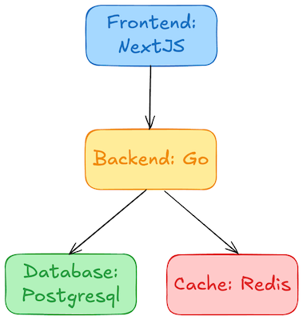
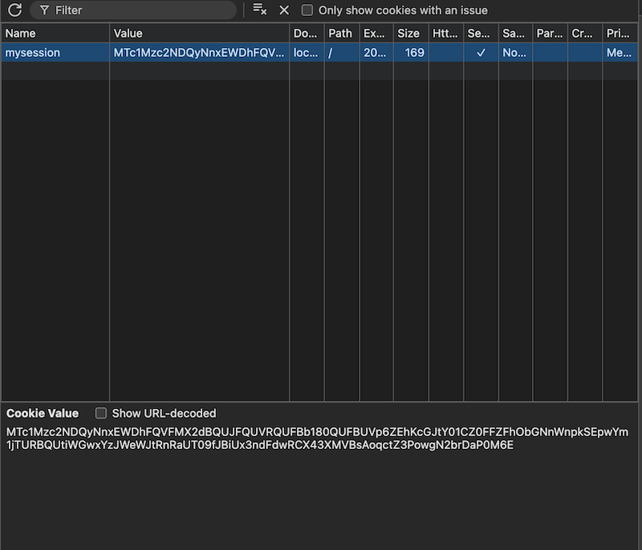

# modernize-app-with-twelve-factor


เป้าหมาย: เพื่อใช้ฝึกการพัฒนา app ตาม Twelve Factor App ในแต่ละขั้นตอน เริ่มจากโปรเจกต์ที่ไม่เป็น Twelve-Factor แล้วค่อยๆ refactor ทีละข้อ

## การ Setup ระบบ

ปกติขั้นตอนการ run ระบบขึ้นมา Admin ต้องพิมพ์คำสั่งตามขั้นตอนดังนี้นี้

### ขั้นตอนที่ 1 สร้าง database

```
docker run -d \
  --name my-postgres \
  -e POSTGRES_USER=postgres \
  -e POSTGRES_PASSWORD=postgres \
  -e POSTGRES_DB=mydb \
  -p 5432:5432 \
  -v pgdata:/var/lib/postgresql/data \
  postgres:14
```

### ขั้นตอนที่ 2 การรัน Radis

```
docker run -d \
  --name my-redis \
  -p 6379:6379 \
  redis:7
```

### ขั้นตอนที่ 3 การรัน Service backend

```
cd backend
go mod init github.com/your-org/backend
go mod tidy
go build -o server
./server
```

### ขั้นตอนที่ 4 การรัน Service frontend

```
cd frontend
npm install
npm run dev
```

### ขั้นตอนที่ 5 ทดสอบการใช้งาน

```
http://localhost:3000
```

## modernize ทีละ step   ✅❌

### Step 1: ลองรีวิวโค้ดดูก่อนว่ามีส่วนไหนมั๊ยที่ไม่ตรงตาม Twelve Factor

##### 1.Codebase ✅

มีการทำ version control สำหรับ code แล้ว

##### 2.Dependencies ✅

- ใน backend มีการเก็บ depedency พร้อม version ไว้ใน go.mod เรียบร้อยแล้ว
- ใน frontend มีการเก็บ depedency พร้อม version ไว้ใน package.json เรียบร้อยแล้ว

##### 3.Config ❌

- ไม่มีการเรียกใช้ configuration ใน environment

##### 4.Backing services ✅

- มีการเรียกใช้ database, redis แยกออกจากตัวโปรแกรม อยู่แล้ว

##### 5.Build, Release and Run ❌

##### 6.Process ❌

เรามี 2 api ที่ใช้ login และ getprofile อธิบายดังนี้

- client api/login มา แล้ว backend ส่งค่า username กลับไป ให้ client save ไว้ที่ client
- client ส่ง api/profile มาเพื่ิอขอรายละเอียด โดยแนบ username มาด้วย -> server return ข้อมูล กลับไป

```go
	r.GET("/api/login", func(c *gin.Context) {
		username := "myusername"
		c.JSON(http.StatusOK, gin.H{
			"message": "User logged in",
			"user":    username,
		})
	})

	// ดึง user จาก query parameter (เช่น /api/profile?user=myusername)
	r.GET("/api/profile", func(c *gin.Context) {
		user := c.Query("user") // รับค่าผ่าน query string
		if user == "" {
			c.JSON(http.StatusUnauthorized, gin.H{"error": "Unauthorized"})
			return
		}
		c.JSON(http.StatusOK, gin.H{"user": user})
	})
```

โดยมีข้อเสียดังนี้

- ต้องส่ง username ทุกครั้งใน URL → ไม่ปลอดภัยและไม่สะดวก
- ผู้ใช้สามารถเปลี่ยนค่า user=myusername เองได้ → เสี่ยงต่อการ spoofing

##### 7.Port binding ✅

มี code อยู่แล้วใน backend

```
	fmt.Println("Backend running on port", port)
	r.Run(":" + port)
```

##### 8.Concurrency ❌

##### 9.Disposability ❌

##### 10.Dev/prod parity ❌

##### 11.Logs ❌

##### 12.Admin process ❌

- ปัญหา
  Admin ต้องทำงานหลายขั้นตอน หรือบางทีก็จำวิธีการเดิมไม่ได้ ส่งผลให้เกิดการทำงานผิดพลาดและล่าช้า

##### สรุป

| topic                     | pass |
| ------------------------- | :--: |
| 1. Codebase               |  ✅  |
| 2. Dependencies           |  ✅  |
| 3. Config                 |  ❌  |
| 4. Backing services       |  ✅  |
| 5. Build, Release and Run |  ❌  |
| 6. Process                |  ❌  |
| 7. Port binding           |  ✅  |
| 8. Concurrency            |  ❌  |
| 9. Disposability          |  ❌  |
| 10. Dev/prod parity       |  ❌  |
| 11. Logs                  |  ❌  |
| 12. Admin process         |  ❌  |

### Step 2: ค่อยๆ แก้ไขไปทีละจุด

#### เพิ่ม 3.config

มีอยู่ 2 รูปแบบคือจัดเก็บใน environment ของเครื่อง และใน .env file ซึ่งมีข้อดีข้อเสียแตกต่างกัน
ในที่นี้เราจะจัดเก็บใน environment ของเครื่อง

```
export APP_PORT=9000
export DATABASE_DSN="host=db user=postgres password=postgres dbname=mydb port=5432 sslmode=disable"
export REDIS_ADDR="cache"
```

ดูว่ามีค่า config ใน environment หรือยัง

```bash
env | grep APP_PORT
env | grep DATABASE_DSN
env | grep REDIS_ADDR
```

แก้ไข code

```
// Load config
port := "8080"
dsn := "host=localhost user=postgres password=postgres dbname=mydb port=5432 sslmode=disable"
redisAddr := "localhost:6379"
```

เป็น

```go
// Load config from environment variables
port := os.Getenv("APP_PORT")
if port == "" {
  port = "8080" // fallback default
}

dsn := os.Getenv("DATABASE_DSN")
if dsn == "" {
  dsn = "host=localhost user=postgres password=postgres dbname=mydb port=5432 sslmode=disable"
}

redisAddr := os.Getenv("REDIS_ADDR")
if redisAddr == "" {
  redisAddr = "localhost:6379"
}

fmt.Println("Port:", port)
fmt.Println("DSN:", dsn)
fmt.Println("Redis Addr:", redisAddr)
```

#### ปรับปรุง 5.Build, Release and Run

จากเดิมเราต้องมา run command เพื่อสร้าง databae, redis, backend, frontend ที่นี้เราสามารถมัดรวมกันทีเดียว โดยมีตัวจัดการเป็น docker-compose
โดยเราต้องสร้างไฟล์ docker-compose และ Dockerfile ใน backend และ frontend

```yml
### docker-compose.yml
version: "3.9"
services:
  frontend:
    build: ./frontend
    ports:
      - "3000:3000"

  backend:
    build: ./backend
    ports:
      - "8080:8080"
    depends_on:
      - db
      - cache

  db:
    image: postgres:14
    restart: always
    environment:
      POSTGRES_USER: postgres
      POSTGRES_PASSWORD: postgres
      POSTGRES_DB: mydb
    volumes:
      - postgres-data:/var/lib/postgresql/data

  cache:
    image: redis:7
    restart: always

volumes:
  postgres-data:
```

```bash
### Dockerfile ใน backend
FROM golang:1.21-alpine

WORKDIR /app
COPY . .
RUN go mod tidy
RUN go build -o server

CMD ["./server"]
```

```bash
### Dockerfile ใน frontend
FROM node:18-alpine

WORKDIR /app
COPY . .
RUN npm install
RUN npm run build

EXPOSE 3000
CMD ["npm", "start"]
```

แล้วเราใช้คำสั่งเดียวในการรัน app

```bash
docker compose up --build -d
### output
```

#### ปรับปรุง 12.Admin Process

สร้าง makefile ขึ้นมา เพื่อเพิ่่ม process ในการ run, restart และ down ระบบขึ้นมา เพื่อให้ admin สามารถมาทำงานได้ในคำสั่งเดียว

```bash
###Makefile
run:
	docker compose up --build -d

restart:
	docker compose restart

down:
	docker compose down -v
```

admin สามารถรันคำสั่ง make ตามด้วย keyword ที่กำหนดไว้ได้

```bash
make run
make restart
make down
```

#### ปรับปรุง 6.Process

การแก้ไขจาก code เดิม

```go
	r.GET("/api/login", func(c *gin.Context) {
		username := "myusername"
		c.JSON(http.StatusOK, gin.H{
			"message": "User logged in",
			"user":    username,
		})
	})

	// ดึง user จาก query parameter (เช่น /api/profile?user=myusername)
	r.GET("/api/profile", func(c *gin.Context) {
		user := c.Query("user") // รับค่าผ่าน query string
		if user == "" {
			c.JSON(http.StatusUnauthorized, gin.H{"error": "Unauthorized"})
			return
		}
		c.JSON(http.StatusOK, gin.H{"user": user})
	})
```

เป็น

```go
import "github.com/gin-contrib/sessions"
import "github.com/gin-contrib/sessions/cookie"

store := cookie.NewStore([]byte("secret"))
r.Use(sessions.Sessions("mysession", store))

r.GET("/api/login", func(c *gin.Context) {
	session := sessions.Default(c)
	session.Set("user", "myusername")
	session.Save()
	c.JSON(http.StatusOK, gin.H{"message": "User logged in"})
})

r.GET("/api/profile", func(c *gin.Context) {
	session := sessions.Default(c)
	user := session.Get("user")
	if user == nil {
		c.JSON(http.StatusUnauthorized, gin.H{"error": "Unauthorized"})
		return
	}
	c.JSON(http.StatusOK, gin.H{"user": user})
})

```

| ประเด็น               | แบบไม่ใช้ session                        | แบบใช้ session                                       |
| --------------------- | ---------------------------------------- | ---------------------------------------------------- |
| **ความปลอดภัย**       | ต้องใส่ user ทุก request → เสี่ยงโดนขโมย | Session ถูกเก็บฝั่ง server/HTTP cookie → ปลอดภัยกว่า |
| **สะดวกในการใช้งาน**  | ต้องแนบ user ทุกครั้ง                    | เก็บไว้ใน session แล้ว reuse ได้ทุก request          |
| **ขยายระบบได้ง่าย**   | ยากต่อการควบคุม login/logout             | ควบคุมสถานะผู้ใช้ได้ง่ายขึ้น                         |
| **ป้องกัน spoofing**  | ใครก็เข้าถึง endpoint ได้ถ้ามี username  | ตรวจสอบ session ก่อนเสมอ                             |
| **มาตรฐานเว็บทั่วไป** | ไม่เหมาะกับการ login/logout แบบจริงจัง   | เหมาะกับระบบที่มี authentication, user session       |

โดยมีประสิทธิภาพดังนี้

- การใช้ session ลด overhead จากการส่งข้อมูลผู้ใช้ซ้ำไปซ้ำมา
- สามารถเก็บ session บน Redis/memory สำหรับระบบขนาดใหญ่
- รองรับระบบ login แบบ single-sign-on (SSO) หรือ session expiration ได้ง่าย

ทดสอบการทำงานดังนี้

- เปิด Web browser -> inspection

```
เข้าไปที่ http://localhost:8080/api/login
### ouput message
{"message":"User logged in"}
```

สามารถดูได้ว่ามี mysession ใน cookies


```
- เข้า http://localhost:8080/api/profile
### output message
{"user":"myusername"}
```

### พักแป๊ปนึง ตอนนี้เราปรับปรุง code ไปถึงไหนแล้วบ้าง

| topic                     | pass |
| ------------------------- | :--: |
| 1. Codebase               |  ✅  |
| 2. Dependencies           |  ✅  |
| 3. Config                 |  ✅  |
| 4. Backing services       |  ✅  |
| 5. Build, Release and Run |  ✅  |
| 6. Process                |  ✅  |
| 7. Port binding           |  ✅  |
| 8. Concurrency            |  ❌  |
| 9. Disposability          |  ❌  |
| 10. Dev/prod parity       |  ❌  |
| 11. Logs                  |  ❌  |
| 12. Admin process         |  ✅  |
